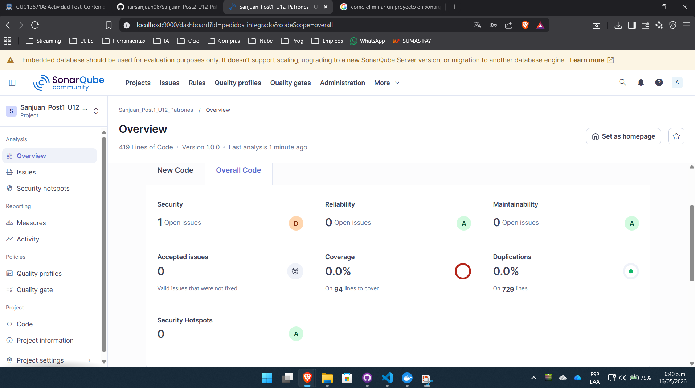

# Sanjuan_Post1_U12_Patrones

**Unidad 12 — Integración de Patrones y Arquitecturas**  
Patrones de Diseño de Software · Ingeniería de Sistemas · UDES 2026

---

## Descripción

Sistema de gestión de pedidos en Spring Boot que integra cuatro patrones de diseño GoF sobre una arquitectura Hexagonal. El objetivo es demostrar cómo cada patrón resuelve un problema de diseño concreto y cómo sus capas son verificables con ArchUnit.

---

## Arquitectura del Sistema

El proyecto sigue una estructura **feature-first** con separación hexagonal:

```
com.empresa.pedidos/
├── dominio/                     ← Núcleo de negocio (sin dependencias externas)
│   ├── Pedido.java
│   ├── TipoPedido.java
│   ├── EstadoPedido.java
│   └── puertos/                 ← Interfaces (contratos del dominio)
│       ├── RepositorioPedidos.java
│       ├── ProcesadorPedido.java
│       └── ServicioNotificacion.java
├── aplicacion/                  ← Casos de uso y Factory
│   ├── ServicioPedidos.java
│   ├── ProcesadorPedidoFactory.java
│   └── PedidoProcesadoEvent.java
├── infraestructura/             ← Implementaciones técnicas
│   ├── persistencia/
│   │   ├── PedidoJpaRepository.java
│   │   └── RepositorioPedidosJpa.java
│   └── notificaciones/
│       ├── NotificacionEmail.java
│       └── NotificacionLog.java
└── adaptadores/                 ← Entrada/salida del sistema
    ├── procesadores/            ← Estrategias de cálculo
    │   ├── ProcesadorPedidoEstandar.java
    │   ├── ProcesadorPedidoExpress.java
    │   └── ProcesadorPedidoInternacional.java
    ├── facade/
    │   └── FachadaPedidos.java
    └── rest/
        └── PedidoController.java
```

### Flujo de una petición POST /api/pedidos

```
PedidoController
      │ delega
      ▼
FachadaPedidos (Facade)
      │ invoca
      ▼
ServicioPedidos
      ├─► ProcesadorPedidoFactory (Factory) ──► ProcesadorPedido* (Strategy)
      ├─► RepositorioPedidos (puerto) ──────────► RepositorioPedidosJpa (Adapter)
      └─► ApplicationEventPublisher ────────────► NotificacionEmail (Observer)
                                                 NotificacionLog   (Observer)
```

---

## Justificación de Patrones

### 1. Strategy — desacoplar el algoritmo de cálculo

**Problema:** El servicio legacy usaba un bloque `if/else if` para calcular el costo según el tipo de pedido. Cada nuevo tipo de pedido requería modificar la clase de servicio (viola OCP).

**Solución:** La interfaz `ProcesadorPedido` define el contrato; cada implementación encapsula su propia regla de cálculo:

| Tipo         | Fórmula                       |
|--------------|-------------------------------|
| ESTANDAR     | subtotal × 1.1                |
| EXPRESS      | subtotal × 1.3                |
| INTERNACIONAL| subtotal × 1.5 + $25.00       |

**Justificación:** La variación es real (3 tipos documentados), frecuente (nuevos tipos de envío son previsibles) y cada algoritmo tiene una regla de negocio distinta. Cumple la Regla del Problema Primero (sección 1.2 de la guía).

---

### 2. Factory — selección dinámica de Strategy

**Problema:** Algún componente necesitaba decidir cuál estrategia usar en tiempo de ejecución según el tipo de pedido, sin que el servicio de aplicación conozca las implementaciones concretas.

**Solución:** `ProcesadorPedidoFactory` recibe por inyección de dependencias todas las implementaciones de `ProcesadorPedido` y construye un `Map<TipoPedido, ProcesadorPedido>`. El servicio solo llama `factory.obtener(tipo)`.

**Justificación:** Spring DI actúa como Factory implícita para la mayoría de los beans, pero aquí la selección requiere lógica de negocio (lookup por tipo de pedido) que el contenedor no resuelve solo. Esto justifica la Factory manual según la regla de la guía (sección 1.2).

---

### 3. Observer — notificación desacoplada con Spring Events

**Problema:** El servicio legacy tenía acoplamiento directo a `JavaMailSender`. Agregar un nuevo canal de notificación requería modificar el servicio de aplicación.

**Solución:** Se publica `PedidoProcesadoEvent` vía `ApplicationEventPublisher`. Cada listener (`NotificacionEmail`, `NotificacionLog`) suscribe con `@EventListener` y actúa de forma independiente.

**Justificación:** Los suscriptores (email, log, SMS en el futuro) son independientes entre sí y opcionales. El orden de notificación no importa. Esto cumple el contexto de uso del patrón Observer según la tabla de la guía (sección 1.1).

---

### 4. Facade — interfaz simplificada para el controlador

**Problema:** Sin Facade, el controlador REST necesitaría inyectar `ServicioPedidos`, `ProcesadorPedidoFactory` y `RepositorioPedidos`, aumentando su acoplamiento efferente (CE).

**Solución:** `FachadaPedidos` expone únicamente los métodos que el controlador necesita (`crearPedido`, `buscarPorId`, `listarPendientes`). El controlador tiene una sola dependencia.

**Justificación:** El controlador es la capa de entrada con mayor tasa de cambio (CE ≈ 1). Mantener su CE bajo reduce su fragilidad ante cambios internos (sección 3.1 de la guía).

---

## Métricas de Calidad — Antes vs Después

| Métrica                      | ServicioPedidosLegacy | FachadaPedidos + patrón |
|------------------------------|-----------------------|-------------------------|
| Cyclomatic Complexity        | 4                     | 1                       |
| Cognitive Complexity         | 6                     | 0                       |
| Acoplamiento a JavaMailSender| Directo               | Eliminado               |
| Acoplamiento a JPA Repository| Directo               | Solo en infraestructura |
| Testabilidad sin Spring      | Baja                  | Alta                    |

> Las capturas de SonarQube se encuentran en la carpeta `/capturas/`.

---

## Verificación con ArchUnit

Las reglas de arquitectura se ejecutan como pruebas JUnit en cada build:

```java
// El dominio no debe depender de infraestructura
noClasses().that().resideInAPackage("..dominio..")
    .should().dependOnClassesThat()
    .resideInAnyPackage("..infraestructura..", "..adaptadores..");

// Los controladores solo acceden a la Facade
classes().that().resideInAPackage("..adaptadores.rest..")
    .should().onlyAccessClassesThat()
    .resideInAnyPackage("..adaptadores.facade..", "..dominio..", ...);
```

---

## Ejecución

```bash
# Compilar y ejecutar pruebas (incluye ArchUnit)
mvn clean package

# Levantar la aplicación
mvn spring-boot:run

# Análisis SonarQube (requiere Docker con SonarQube en puerto 9000)
mvn clean verify sonar:sonar \
  -Dsonar.projectKey=Sanjuan_Post1_U12_Patrones \
  -Dsonar.host.url=http://localhost:9000 \
  -Dsonar.login=<token>
```

## Endpoints REST

| Método | URL                        | Descripción                    |
|--------|----------------------------|--------------------------------|
| POST   | `/api/pedidos`             | Crea y procesa un pedido       |
| GET    | `/api/pedidos/{id}`        | Busca un pedido por ID         |
| GET    | `/api/pedidos/pendientes`  | Lista pedidos en estado PENDIENTE |

### Ejemplo de petición

```json
POST /api/pedidos
{
  "cliente": "Jair Sanjuan",
  "subtotal": 100.0,
  "tipo": "EXPRESS"
}
```

```json
// Respuesta esperada
{
  "id": 1,
  "cliente": "Jair Sanjuan",
  "subtotal": 100.0,
  "costo": 130.0,
  "tipo": "EXPRESS",
  "estado": "PROCESADO"
}
```

## Tecnologías

- Java 17 · Spring Boot 3.2.5 · Spring Data JPA · H2 · Maven
- ArchUnit 1.2.1 · JUnit 5 · AssertJ
- SonarQube (análisis de calidad)

